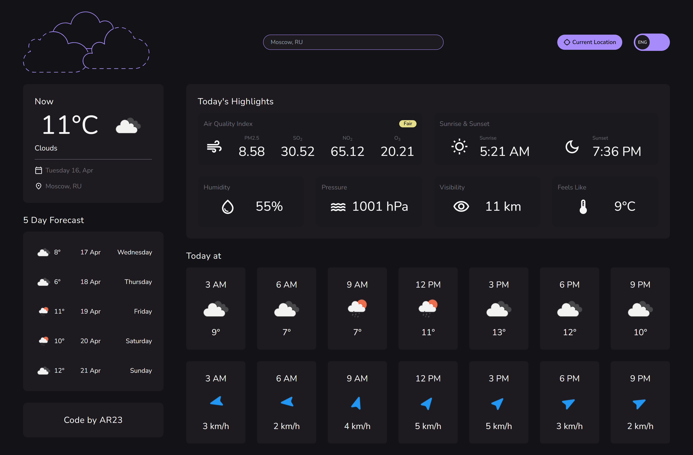

# Weather API React App - Javascript + Vite + Tailwind CSS + i18next

This is a React app that uses the [OpenWeatherMap](https://openweathermap.org/api) API to display the current weather in a city.

### Screenshots




## Getting Started

- Clone repository and `cd` into it
- In the `Api.js` file, change the API keys as follows:

```text
X-RapidAPI-Key: YOUR_X-RapidAPI-Key
X-RapidAPI-Host: YOUR_X-RapidAPI-Host

GEO_API_URL=YOUR_GEO_API_URL

WEATHER_API_URL=YOUR_OPEN_WEATHER_API_URL
WEATHER_API_KEY=YOUR_OPEN_CAGE_API_KEY
```

- In the `App.jsx` file, change the IP_API key as follows:

```text
IP_API=YOUR_IP_API_KEY
```

- Install the dependencies and run the dev server

```bash
npm i
npm run dev
```

- Open [localhost:3000](http://localhost:3000) to view the app in the browser

## Resources

- [ipinfo.io](https://ipinfo.io/)
- [OpenWeatherMap](https://openweathermap.org/api)
- [GeoDB Cities](http://geodb-cities-api.wirefreethought.com/)

### Live Demo

[Click](https://ar23-weather-app.vercel.app)
